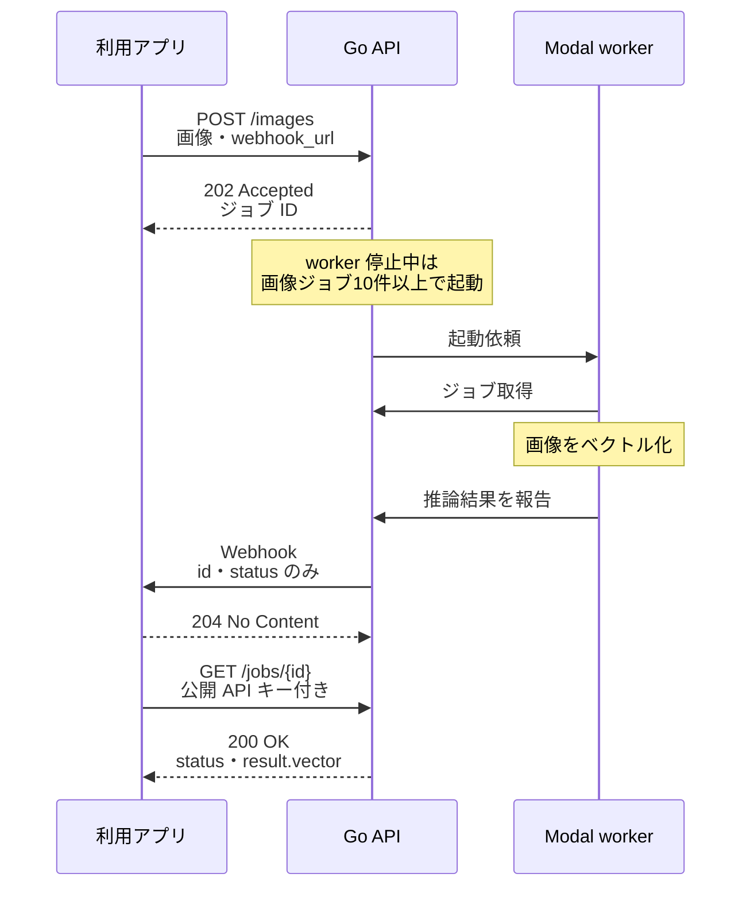
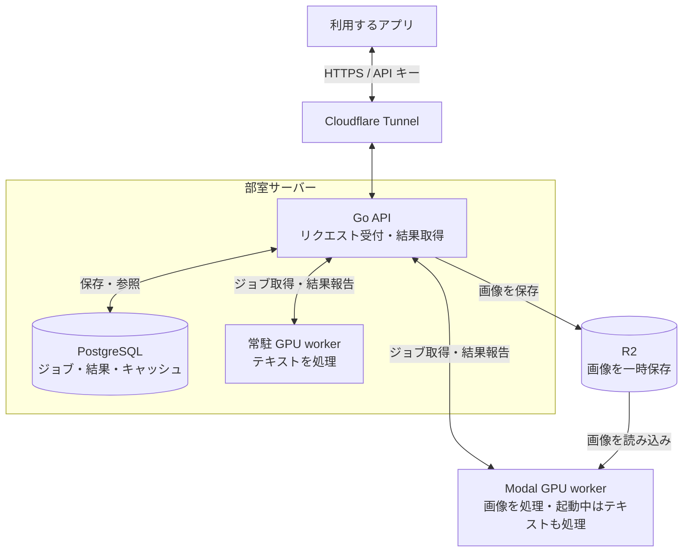

# embedding-server

文章や画像を 4096 次元のベクトルに変換する API です。ベクトルで意味の近さを比較し、主に traQ の添付画像をテキストのクエリから探すために使います。

## 入力・モデル・出力

| 項目 | 内容 |
| --- | --- |
| 入力 | テキスト、画像、テキスト＋画像 |
| モデル | Qwen3-VL-Embedding-8B。テキストと画像に同じモデルを使用 |
| 出力 | L2 正規化した 4096 要素の数値配列 |

## 接続と認証

| 用途 | URL |
| --- | --- |
| API を呼び出す | [https://embeddings.mumumu6.net](https://embeddings.mumumu6.net) |
| 仕様を見てブラウザから試す | [Swagger UI](https://api-embeddings.mumumu6.net) |

公開 API はすべて、ジョブの GET も含めて公開 API キーで認証します。キーの配布窓口は管理者の mumumu です。

```http
Authorization: Bearer <API_KEY>
```

`INTERNAL_API_KEY` は worker と Go API の通信、Go API から Modal への起動依頼に使います。公開 API には使いません。

公開 API キーは利用者間で共有しており、ジョブごとの所有者確認はありません。

[Swagger UI](https://api-embeddings.mumumu6.net) では API 仕様を確認し、`Authorize` に公開キーを設定してリクエストを実行できます。

## API 一覧

| メソッド・パス | 入力 | 成功レスポンス |
| --- | --- | --- |
| `POST /v1/embeddings/text` | JSON の `text` | `200` と `vector`。同期 |
| `POST /v1/embeddings/images` | multipart の `images`、任意の `webhook_url` | `202` とジョブ ID。非同期 |
| `POST /v1/embeddings/multimodal` | multipart の `text` または `images`、任意の `webhook_url` | `202` とジョブ ID。非同期 |
| `GET /v1/embeddings/jobs/{id}` | ジョブ ID | `200` と状態。完了時は `result.vector` も返す |

`/multimodal` はテキストだけでも利用できますが、常に非同期です。画像を含む場合は画像ジョブとして処理します。

## テキスト → ベクトル

`POST /v1/embeddings/text` は、同じ HTTP リクエストへの応答にベクトルを返します。Webhook や後続の GET は不要です。

- キャッシュあり：保存済みのベクトルを返す。
- キャッシュなし：常駐 worker の推論完了を待ち、ベクトルを返す。

テキストは1件から処理します。キャッシュがない場合は、キューでの待ち時間と推論時間がかかります。

サーバーが結果を待つ上限は500秒です。超えると `504` を返します。中継プロキシやクライアントのタイムアウトが先に発生する場合もあります。

入力例：

```json
{"text":"猫が窓辺で寝ている"}
```

成功時のレスポンス例（配列は表示用に短縮。実際は4096要素）：

```json
{"vector":[0.0123,-0.0456,0.0789]}
```

## 画像 → ジョブ ID

`POST /v1/embeddings/images` は画像を R2 へ保存してジョブを登録し、推論完了を待たずに `202` とジョブ ID を返します。

```json
{"id":"123e4567-e89b-42d3-a456-426614174000"}
```

1回の POST が1ジョブです。複数画像を送った場合は、その全体に対して1本のベクトルを生成します。`/multimodal` では、テキストと画像をひとつの入力として扱います。

## 画像 worker の起動条件

GPU の起動とモデル読み込みの費用を抑えるため、画像ジョブをまとめて処理します。サービス全体で未処理の画像ジョブが10件以上になると、Go API が Modal worker の起動を依頼します。

- worker が停止中で1〜9件しかなければ、ジョブは `pending` のまま追加のジョブを待つ。
- worker が既に起動中なら、10件未満でも処理される場合がある。
- 10件に達した後も、GPU の起動・モデル読み込み・推論の時間がかかる。

起動条件の10件と、1回の推論にまとめる件数は別の設定です。受付の `202` は先に返ります。GET による状態確認や時間の経過だけでは worker は起動しません。

設定変更・手動実行・復旧は [Modal の画像 worker](development.md#modal-の画像-worker) を参照してください。

## 画像の受付 → Webhook → GET

`webhook_url` を指定した画像ジョブが正常完了した場合の流れです。



Webhook は完了・失敗を通知します。結果のベクトルは、公開 API キーを付けて GET で取得します。`webhook_url` を省略した場合も、GET で状態・結果を取得できます。

## ジョブ ID → 状態・結果

`GET /v1/embeddings/jobs/{id}` が返す状態は次の4種類です。

| `status` | 意味 | `result` |
| --- | --- | --- |
| `pending` | 処理待ち。画像ジョブが10件以上になるまで待つ場合がある | なし |
| `processing` | worker が取得して処理中 | なし |
| `completed` | 処理完了 | `vector` を含む |
| `failed` | 処理失敗 | なし |

完了時のレスポンス例（配列は表示用に短縮）：

```json
{
  "id":"123e4567-e89b-42d3-a456-426614174000",
  "status":"completed",
  "result":{"vector":[0.0123,-0.0456,0.0789]}
}
```

`failed` の場合も HTTP ステータスは `200` です。失敗理由は公開レスポンスに含まれません。GET はその時点の状態を返し、処理完了まで待機しません。

## Webhook を使う場合

画像・multimodal の POST に `webhook_url` を指定すると、完了・失敗時に指定先へ POST を送ります。

```json
{"id":"123e4567-e89b-42d3-a456-426614174000","status":"completed"}
```

通知本文は `id` と `status` のみです。失敗時の `status` は `failed` です。ベクトル・エラー本文・署名・認証ヘッダーは送信しません。

## 入力・利用上の制限

| 項目 | 制限・動作 |
| --- | --- |
| text | 1〜8192文字。前後の空白を除去。空白のみは不可 |
| 画像 | PNG / JPEG / WebP、最大4枚、1枚20 MiB |
| 画像の画素数 | 1枚2000万画素まで。破損・超過は受付後に `failed` になる場合がある |
| HTTP リクエスト本文 | 画像系は81 MiB、その他は1 MiB |
| Webhook URL | 最大2048文字。読み取り時にも2048 bytes の上限 |
| 同期 text の混雑時 | 未処理 text が30件以上なら、キャッシュにない新規要求を `503` で拒否 |
| ジョブの保存 | 作成から6時間を超えると清掃対象 |

画像の入力形式は multipart のファイルです。複数枚は同じ `images` フィールドを繰り返します。画像 URL・Base64 の JSON・テキスト配列・モデルや出力次元の指定は受け付けません。

`/multimodal` に `text` フィールドがある場合、画像の有無にかかわらず空文字・空白のみは拒否します。非同期 text と画像には、同期 text と同じ30件のキュー制限や利用者別のレート制限はありません。

## エラーレスポンス

| HTTP | 主な条件 |
| --- | --- |
| `400` | 入力形式・文字数・画像・Webhook URL・ジョブ UUID が不正 |
| `401` | 公開 API キーの欠落・不一致 |
| `404` | ジョブが存在しない、または清掃済み |
| `413` | リクエストのサイズ超過。読み取り経路によっては `400` になる場合もある |
| `503` | 同期 text のキューが混雑。`Retry-After: 30` を返す |
| `504` | 同期 text の結果待ちが500秒を超過 |
| `500` | サーバー内部エラー、同期 text の推論失敗など |

各フィールドの仕様は [OpenAPI](../../openapi.yaml) を参照してください。

## 全体構成



画像は Modal worker が yomitoku で文字を読み取り、画像と認識テキストを Qwen に渡してベクトル化します。常駐 worker はテキストのみを処理します。

## 詳しく読む

| ページ | 分かること |
| --- | --- |
| [構成とモデル](architecture.md) | サーバー・Modal・保存先の役割、モデル・GPU・OCR、内部処理の流れ |
| [開発者向けガイド](development.md) | 環境構築、テスト、デプロイ、設定変更 |
| [OpenAPI](../../openapi.yaml) | エンドポイントとリクエスト／レスポンスの詳細仕様 |

構成・ローカル設定の確認日: 2026-10-05。
